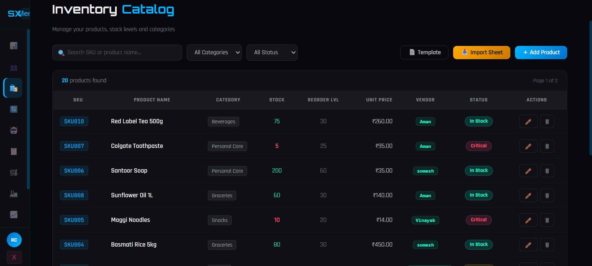

# 🛒 SmartShelfX – AI-Powered Inventory Management System

## 📌 Overview

SmartShelfX is a full-stack AI-based inventory management system that helps businesses track products, predict demand, and automate stock decisions using machine learning.

---

## 🚀 Features

* 📦 Inventory management (CRUD operations)
* 🔐 Authentication & Authorization
* 📊 Real-time analytics dashboard
* 🤖 AI-based demand forecasting
* 🚨 Low stock alerts
* 👥 Role-based access (Admin/User/Vendor)

---

## 🧠 Tech Stack

### Frontend

* Angular
* TypeScript
* SCSS

### Backend

* Node.js
* Express.js
* MySQL

### Machine Learning

* Python
* Flask
* Pandas, Scikit-learn

---

## 🏗️ Architecture


---

## 📸 Screenshots

### 🔐 Login Page


### 📊 Dashboard


### 📦 Inventory Management



### 🤖 Forecasting


---

## ⚙️ Installation & Setup

### 1. Clone the repository

```bash
git clone https://github.com/ramcharansadu46-bit/smartshelfx-personal.git
```

### 2. Install dependencies

#### Frontend

```bash
cd frontend
npm install
```

#### Backend

```bash
cd backend
npm install
```

#### ML Service

```bash
cd ml-service
pip install -r requirements.txt
```

---

## ▶️ Run the Project

### Start Backend

```bash
cd backend
node server.js
```

### Start Frontend

```bash
cd frontend
ng serve
```

### Start ML Service

```bash
cd ml-service
python main.py
```

---

## 📈 Future Improvements

* Deploy on cloud (AWS/Azure)
* Add real-time notifications
* Improve ML model accuracy

---

## 👨‍💻 Author

Ramcharan Sadu
